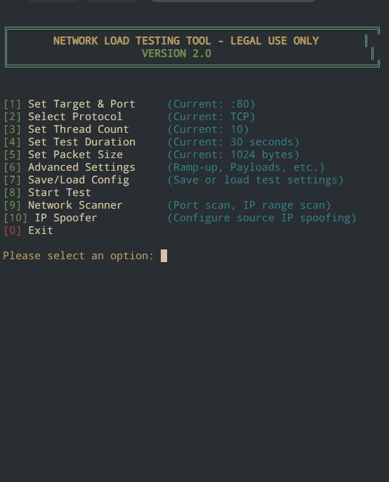

<p align="center">
  
</p>
## 🌐 PacketStorm v2.0

> ⚠️ **This tool is intended strictly for legal and ethical testing purposes. Unauthorized usage may violate laws. Use responsibly and at your own risk.**

## 📖 Overview

This tool is an interactive Python-based network load tester. It allows you to simulate various network protocols, send custom or predefined payloads, spoof IP addresses, and perform advanced scanning. It is suitable for educational use, lab simulations, or internal infrastructure testing.

## ✨ Features

- Terminal-based interactive UI
- Supports TCP, UDP, HTTP, ICMP (Ping), Slowloris, SYN Flood
- Built-in predefined payloads (Minecraft, RDP, DNS, HTTP, etc.)
- Custom payload entry (text and binary supported)
- Ramp-up mode for progressive load increase
- Spoofing modes: none, fixed IP, random IP, IP range
- Save/load test configurations to/from JSON
- Port scanner and IP range scanner included
- Works on Windows, Linux (may require admin/root for some features)
- Colorized output using `colorama` (optional)

## 🚀 Getting Started

### 1. Clone the Repository

```bash
pip install requests colorama ssl 
git clone https://github.com/telebotmake/PacketStorm.git
cd PacketStorm
python ddos.py
